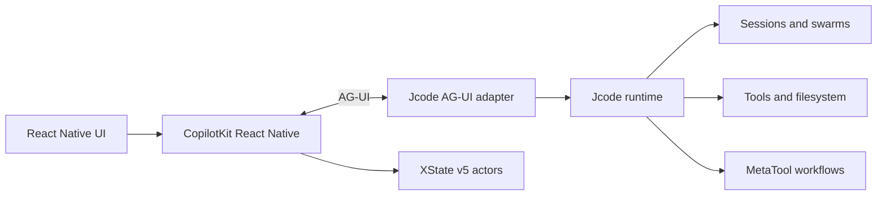

# Jcode React Native via CopilotKit, AG-UI, and XState

Status: accepted direction, superseding the bespoke mobile protocol plan

Date: 2026-07-28

## Decision

Jcode's React Native frontend will use:

1. **`@copilotkit/react-native`** as the headless React Native integration.
2. **AG-UI** as the standard agent-to-frontend protocol for streaming messages, shared state, frontend tool calls, interrupts, human-in-the-loop interactions, and custom events.
3. **Portable XState v5 machine definitions and snapshots** as the application-level workflow representation carried through AG-UI shared state or custom events.
4. **Jcode on a remote host** as the authoritative execution environment for sessions, models, tools, files, processes, browser automation, swarms, and MetaTool workflows.

Jcode will expose an AG-UI-compatible adapter alongside its existing native WebSocket gateway. Existing TUI, desktop, and native protocol clients remain supported.

## Supersedes

This decision explicitly supersedes the earlier plan to make the React Native application a direct, bespoke client of Jcode's native WebSocket protocol and to invent a Jcode-specific dynamic component/reducer wire format.

Reusable work from that direction may remain, including:

- Host discovery and pairing concepts
- Secure credential storage
- Session discovery primitives
- Native transcript and workflow UI components
- Reconnection and offline UX

The following are no longer canonical:

- A mobile-specific extension of Jcode's native wire protocol
- A proprietary state snapshot/delta format where AG-UI already supplies `STATE_SNAPSHOT` and RFC 6902 `STATE_DELTA`
- Downloading or executing arbitrary reducer JavaScript
- Treating a custom component-tree protocol as the primary agent/frontend interoperability layer

## Architecture

### Layer ownership

| Layer | Responsibility |
| --- | --- |
| React Native | Native presentation, device interactions, locally registered components and frontend tools |
| CopilotKit React Native | Headless agent hooks, frontend tools, human-in-the-loop bindings, client integration |
| AG-UI | Bidirectional events, streaming, shared state, snapshots, JSON Patch deltas, tool lifecycle, interrupts, custom events |
| XState | Portable workflow semantics, explicit states/events, local actor interpretation, resumable snapshots |
| Jcode AG-UI adapter | Translation between Jcode runtime events/commands and AG-UI events/runs |
| Jcode runtime | Authoritative execution, persistence, permissions, tools, sessions, swarms, background continuity |
| MetaTool | Dynamic composition of bespoke workflows against available frontend and backend capabilities |

## XState contract

Only serializable, versioned XState machine configuration crosses the wire.

- Pin the supported XState major and a Jcode machine-schema version.
- Reference actions, guards, actors, and delays by registered string identifiers.
- Do not transmit executable JavaScript functions.
- Advertise client implementations and versions as capabilities.
- Execute privileged and durable effects on the Jcode server.
- Persist machine hash, machine revision, authoritative snapshot revision, snapshot, and pending effect IDs.
- Use idempotent event and effect identifiers.

AG-UI transports machine definitions, snapshots, events, and state changes. XState interprets the workflow. AG-UI remains the interoperability protocol.

## Dynamic workflow flow

1. The RN client connects through CopilotKit and advertises registered components, frontend tools, XState implementations, and schema versions.
2. Jcode exposes this capability manifest to MetaTool.
3. MetaTool creates a bespoke workflow using available frontend tools and a portable XState machine.
4. Jcode sends the machine and initial state through AG-UI shared state or custom events.
5. The RN client validates the schema, mounts registered components, and starts the XState actor.
6. Client events travel through AG-UI. Local-only transitions may occur immediately.
7. Privileged effects execute authoritatively on Jcode and return success or failure events.
8. Jcode persists the workflow independently of the mobile connection.
9. After reconnect, AG-UI sends an authoritative state snapshot or deltas and restores the XState actor.

## Initial translation boundary

| Jcode runtime concept | AG-UI surface |
| --- | --- |
| Assistant text streaming | Message streaming events |
| Tool start/input/result | Tool-call lifecycle events |
| User prompt | Agent run input |
| Cancel or steering | Interrupt/steering events |
| Session/workflow state | `STATE_SNAPSHOT` and `STATE_DELTA` |
| Swarm status and plan | Shared state or typed custom events |
| Frontend device operation | Frontend tool call |
| Approval request | Human-in-the-loop interaction |
| Portable XState machine | Shared state or typed custom event |

## Safety and compatibility

- Validate all AG-UI payloads and XState schemas before interpretation.
- Allow only registered frontend tools, actions, guards, and actors.
- Keep host-side permissions authoritative.
- Never expose the gateway directly to the public Internet without a secure transport and access-control boundary. Prefer Tailscale initially.
- Preserve Jcode's existing native protocol and clients.
- Unsupported capabilities must produce explicit degradation or refusal, never silent substitution.

## Delivery sequence

1. Document the Jcode runtime-to-AG-UI event mapping.
2. Implement a minimal AG-UI adapter for prompt input and streaming messages.
3. Add tool lifecycle, cancellation, reconnect, and session identity.
4. Build the RN client with `@copilotkit/react-native`.
5. Add shared state snapshots and RFC 6902 deltas.
6. Carry and restore one portable XState machine.
7. Register frontend tools and human approval.
8. Let MetaTool generate one bespoke end-to-end workflow.
9. Add swarm state and richer dynamic native components.

## Evidence consulted

- CopilotKit React Native quickstart: `@copilotkit/react-native` is a headless React Native package exposing `CopilotKitProvider`, `useAgent`, `useFrontendTool`, `useHumanInTheLoop`, and related hooks.
- AG-UI protocol documentation: AG-UI provides bidirectional agent/frontend events, shared state, `STATE_SNAPSHOT`, and RFC 6902 `STATE_DELTA`.
- Jcode source: the existing WebSocket gateway exposes Jcode's native session protocol and remains useful for current clients, but is not the canonical dynamic RN interoperability layer under this decision.

## Open implementation decisions

- Implement AG-UI directly in Rust or initially run a thin adapter service.
- Whether session discovery belongs in the AG-UI adapter, a separate authenticated host API, or both.
- Exact component capability-manifest shape above AG-UI.
- Which XState effects may execute locally versus requiring server confirmation.
- Snapshot storage ownership and retention policy.
